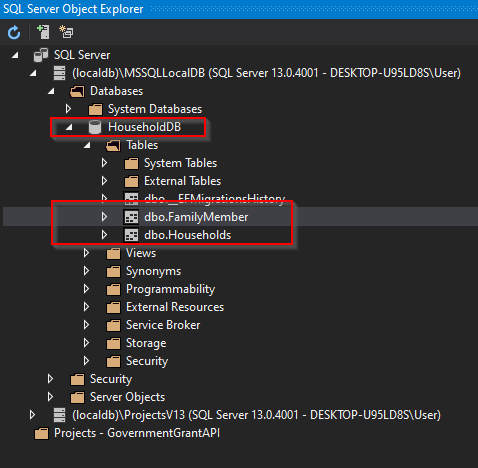
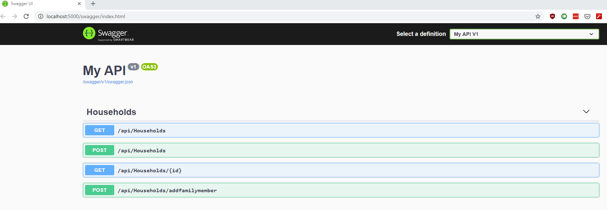

# Government Grant Disbursement API
This is a RESTful API that could decide on groups of people who are eligible for various upcoming government grants.

## How to open this project

To open this project/solution, [Visual Studio 2019](https://visualstudio.microsoft.com/vs/) and [.NET Core 3.1 SDK](https://dotnet.microsoft.com/download) is required to be installed on computer running Microsfot Windows.

The solution file: [GovernmentGrantAPI.sln](./GovernmentGrantAPI/GovernmentGrantAPI.sln)

## Migrating the database

[SQL Server Express](https://www.microsoft.com/en-us/download/details.aspx?id=55994) should have been installed along with Visual Studio 2019.

After opening the solution, ```Update-Database``` command in the ```Package Management Console``` can be used to migrate the SQL Server Express with necessary database tables.

```PS
Update-Database
```

If the migration is successful, there should be a ```HouseholdDB``` database created with two tables ```Housholds``` and ```FamilyMember```.



If a remote/local SQL server is prefer, the connection string in [appsettings.json](./government-grant-api/GovernmentGrantAPI/GovernmentGrantAPI/appsettings.json) couold be modified.

``` JSON
"ConnectionStrings": {
    "HouseholdDBConnection": "server=(localdb)\\MSSQLLocalDB;database=HouseholdDB;Trusted_Connection=true"
}
```

## Running and testing the Web API

After building and runnning the solution, a [Swagger](https://swagger.io/) web interface is launch on a browser window. All the endpoints are accessible using the ```Swagger``` interface.



## API Endpoints overviews

|API | Description | Request body | Response body |
|--- | ---- | ---- | ---- |
|GET /api/Households | Get all households | None | Array of households|
|GET /api/Households/{id} | Get an household by Id | None | household|
|POST /api/Households | Create a household | Housing Type | household |
|POST /api/Households/addfamilymember | Add a family member to a household | a Family Member | household |

## API Endpoint details

### Create Household

- ```POST /api/Households```
- Sample request body
  - HousingType (Possible options: Landed, Condominium, HDB)

``` JSON
{
  "housingType": "HDB"
}
```

- Sample response body (newly added household)
  - ```Id```: A auto-generated id has been added to identify each household
  - ```familyMembers```: Empty for newly added household

``` JSON
{
  "id": 6,
  "housingType": "HDB",
  "familyMembers": []
}
```

### Add family member

- ```POST /api/Households/addfamilymember```
- Sample request body
  - ```householdId``` : existing household Id. If household id not exist, 404 Not found error will be returned.
  - ```name```: Name of the family member,
  - ```gender```: "Male" or "Female",
  - ```maritalStatus```: "Single", "Married", "Widowed", "Separated", or "Divorced". Reference: <https://www.singstat.gov.sg/-/media/files/standards_and_classifications/scms.pdf>
  - ```spouse```: Name of the spouse (if any)
  - ```occupationType```: Unemployed, Student, Employed
  - ```annualIncome```: Annual incom
  - ```dob```: Date of birth in format of ```yyyy-mm-dd```

``` JSON
{
  "householdId": 6,
  "name": "Chan Tai Man",
  "gender": "Male",
  "maritalStatus": "Single",
  "spouse": "",
  "occupationType": "Employed",
  "annualIncome": 100000,
  "dob": "1986-03-04"
}
```

- Sample response body (household with the newly added family member)

``` JSON
{
  "id": 6,
  "housingType": "HDB",
  "familyMembers": [
    {
      "id": 13,
      "name": "Chan Tai Man",
      "gender": "Male",
      "maritalStatus": "Single",
      "spouse": "",
      "occupationType": "Employed",
      "annualIncome": 100000,
      "dob": "1986-03-04"
    }
  ]
}
```

### Show household details

- ```GET /api/Households/{id}```
- ```Id```: The householdId. If household id not exist, 404 Not found error will be returned.

- Sample response body (household with family members)

``` JSON
{
  "id": 6,
  "housingType": "HDB",
  "familyMembers": [
    {
      "id": 13,
      "name": "Chan Tai Man",
      "gender": "Male",
      "maritalStatus": "Single",
      "spouse": "",
      "occupationType": "Employed",
      "annualIncome": 100000,
      "dob": "1986-03-04"
    }
  ]
}
```

### List/Search households

- ```GET /api/Households```

- Sample response body (All households in the database)

``` JSON
[
  {
    "id": 1,
    "housingType": "HDB",
    "familyMembers": [
      {
        "id": 0,
        "name": "member1",
        "gender": "Male",
        "maritalStatus": "Single",
        "spouse": "",
        "occupationType": "Employed",
        "annualIncome": 10000,
        "dob": "1983-04-27"
      }
    ]
  },
  {
    "id": 2,
    "housingType": "Landed",
    "familyMembers": []
  }
]
```

- Optional parameters for searching households and recipients of grant disbursement
  - The following optional parameters are provided to arrow the listing households with defined criteria:

    | Parameter | Datatype | Usage | Example
    |--- | ---- | ---- | --- |
    | hasMemberYoungerThan | int | Return households with member younger than certain age | <http://localhost:5000/api/Households?hasMemberYoungerThan=12>|
    | hasMemberOlderThan | int | Return households with member older than certain age | <http://localhost:5000/api/Households?hasMemberOlderThan=50>|
    | householdIncomeLessThan | double | Return households with total income less than certain amount | <http://localhost:5000/api/Households?householdIncomeLessThan=10000>|
    | hasHusbandAndWife | bool | Return households a least one married couple | <http://localhost:5000/api/Households?hasHusbandAndWife=true>|
    | housingType | HousingType | Return households with certain housing type | <http://localhost:5000/api/Households?housingType=Landed>|

- Households with husband & wife means **At least a pair of married family member have other's name on his/her ```spouse``` field**.
- The following is an example of hushand and wife,

``` JSON
    {
    "id": 5,
    "name": "member2-2",
    "gender": "Female",
    "maritalStatus": "Married",
    "spouse": "member2-1",
    "occupationType": "Employed",
    "annualIncome": 100000,
    "dob": "1940-03-26"
    },
    {
    "id": 10,
    "name": "member2-1",
    "gender": "Male",
    "maritalStatus": "Married",
    "spouse": "member2-2",
    "occupationType": "Employed",
    "annualIncome": 100000,
    "dob": "1930-03-26"
    },
```

#### Combining optional parameters

- The effect of the optional parameters are additive. For example, the following will only return households with member younger than 16 and member older than 50.

<http://localhost:5000/api/Households?hasMemberYoungerThan=12&hasMemberOlderThan=50>

- By combining the optional parameters, we could use the same endpoint to search  for households and recipients of grant disbursement

- Student Encouragement Bonus
  - Households with children of less than 16 years old.
  - Household income of less than $150,000.
  - Web API: <http://localhost:5000/api/Households?hasMemberYoungerThan=16&householdIncomeLessThan=15000>
- Family Togetherness Scheme
  - Households with husband & wife.
  - Has child(ren) younger than 18 years old.
  - Web API: <http://localhost:5000/api/Households?hasMemberYoungerThan=18&hasHusbandAndWife=true>
- Elder Bonus
  - HDB household with family members above the age of 50.
  - Web API: <http://localhost:5000/api/Households?hasMemberOlderThan=50&housingType=HDB>
- Baby Sunshine Grant
  - Household with young children younger than 5.
  - Web API: <http://localhost:5000/api/Households?hasMemberYoungerThan=5>
- YOLO GST Grant
  - HDB households with annual income of less than $100,000.
  - Web API: <http://localhost:5000/api/Households?housingType=HDB&householdIncomeLessThan=100000>
